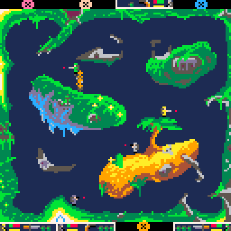

# Pocket Platoon
A [PICO-8](https://www.lexaloffle.com/pico-8.php) party game for up to 8 buddies

### Alpha version - movement test

### Player 1 Keyboard
**Movement**: <kbd>Left</kbd>, <kbd>Right</kbd>, <kbd>Up</kbd>, <kbd>Down</kbd>  
**Start**: <kbd>M</kbd>  
**Jetpack**: <kbd>N</kbd>  

### Player 2 Keyboard
**Movement**:  <kbd>S</kbd>, <kbd>F</kbd>, <kbd>E</kbd>, <kbd>D</kbd>  
**Start**: <kbd>Q</kbd>  
**Jetpack**: <kbd>w</kbd>  

### Player 1 - Player 8 - Joystick / Controller

Any SDL compatible controller with at least 6 buttons  

### Movement

<kbd>Double Down</kbd> while standing - Lie down  
<kbd>Double Down</kbd> or <kbd>Double Up</kbd> while laying - Stand up  
<kbd>Double Left</kbd> or <kbd>Double Right</kbd> while standing - Roll  
Hold <kbd>Down</kbd> while rolling - Lie down  
<kbd>Double Left</kbd> or <kbd>Double Right</kbd> while laying - Mini Roll  

The Jetpack's fuel is drained while the Jetpack button is pushed, it is refilled if the button is not pushed. It refills faster on the ground than in the air.
