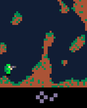
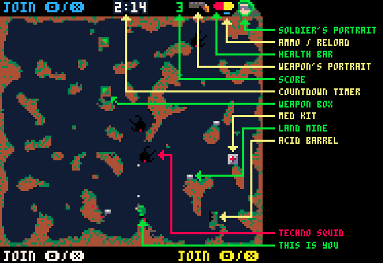

# Pocket Platoon
A [PICO-8](https://www.lexaloffle.com/pico-8.php) party game for up to 4 buddies  
ver: **1.0**  
as of version 1.0 the game is available on [itch.io](https://donbattery.itch.io/pocket-platoon)

  
Test your skills in this fast-paced post-apocalyptic shooter against the invading techno squids (or your buddies)!  
**CLICK ON THE SCREENSHOT TO PLAY**  

This game features:
- Local multiplayer for 4 players  
- 3 game modes (PvE, PvP and PvPvE)  
- Infinite random generated maps (3 different planes: Earth, Void and Ruins with 9 possible color schemes)  
- Pixel perfect terrain destruction  
- 2 power-ups (Med Kit and Weapon Box)  
- 2 traps (Land Mine and Acid Barrel)  
- 10 unique weapons  
- melee combat  
- techno squids  

## Controls  
The PICO-8 controller has 6 buttons: <kbd>Left</kbd>, <kbd>Right</kbd>, <kbd>Up</kbd>, <kbd>Down</kbd>, <kbd>O</kbd> and <kbd>X</kbd>

- Player1 and Player2 can share a keyboard  
- Player1 - Player4 can use any SDL compatible gamepad / controller with at least 6 buttons  
- Thanks to PICO-8's web-player Player1 can use touch controls both in vertical (Game Boy), and horizontal (Game Gear) view  

  
Move horizontally with <kbd>Left</kbd> and <kbd>Right</kbd>  
  
Use your jetpack with <kbd>O</kbd>  
  
Aim in 8 directions, shoot with <kbd>X</kbd>  
  
If the end of your weapon is inside a wall, <kbd>X</kbd> performs a wall-punch  
  
If you, or the end of your weapon is touching another object, <kbd>X</kbd> performs a melee attack  
  

## Objects  
**Med Kit**  
  
Every soldier has 10 HP by default. You can only pick up a Med Kit when your HP is below 10. Picking up a Med Kit will restore your HP to 10.  

**Weapon Box**  
  
You get a Pistol by default. Picking up a Weapon Box will change your weapon to a random weapon which is not a Pistol, and not the one you are currently carrying.  

**Land mine**  
Stepping on a Land Mine will activate it  
  

**Acid Barrel**  
Watch out for Acid Barrels!  
  

**Techno Squid (Weapon: Lazer Melee: Cyber Tentacles)**  
Vicious machine spirit risen from the radioactive ruins of civilization, hunting for the remains of life to destroy  
  

## Main Menu  
  
- Players can join at any stage of the game, by pressing either <kbd>O</kbd> or <kbd>X</kbd>
- After each battle, all players are disconnected, and needs to re-connect for the next battle
- Once connected, navigate in the menu with <kbd>Up</kbd> and <kbd>Down</kbd>
- Select menu options with <kbd>Left</kbd> and <kbd>Right</kbd>
- Submit the menu with <kbd>O</kbd> or <kbd>X</kbd>  

**Mode** controls the game mode:  
- **War** is the PvE mode - there is no friendly fire
- **Arena** is the PvP mode - there are no techno squids
- **Chaos** is the PvPvE mode - everyone is for themselves, and soldier kills scores you 2 points
Time sets the length of the battle in minutes  

**Boxes** controls the amount of Med Kits and Weapon Boxes spawned  

**Traps** controls the amount of Land Mines and Acid Barrels spawned  

**Bots** controls the strength of the invading machine forces  

**Enter the Wastelands** will open the Map Menu  

## Map Menu  
  
- Pressing <kbd>O</kbd> or <kbd>X</kbd> on any menu option will generate a new map with the current settings
- **Density** controls the air/wall ratio
- **Shape** controls how open the map is
- **Fabric** controls the strength of the map, each plane has 3 color schemes
- **Terraform** will just generate a new map
- **Enter the Battle** will generate a new map if there is none, and **start the game**
- **Back to Base** will bring us back to the Main Menu

## In Game  
  
- Race against time to collect as much points as possible
- Killing a soldier or a techno squid will score you one point
- In  War mode you cannot kill other soldiers
- In Arena mode there are no techno squids
- In Chaos mode a soldier kill scores you 2 points
- If a techno squid, a Land Mine or an Acid Barrel kills you, you lose one point
- You also lose one point if you kill yourself
- If you die, you respawn in three seconds

## Arsenal  
| Weapon       | Portrait                         | Usage                | Damage | Burst| Magazine| Fire rate | Reload time|
|------------|------------------------------|----------------------------| -| -| -| -| -|
| Pistol     |  |    |2.8 - 3.2|1|8|2.72|1.5
| Knife     |  |    |6 - 9|1|1|1.3|0.75
| Bolter     |  |    |0.9 - 1.1|1|35|10|2
| Shotgun     |  |    |0.9 - 1.3|5|5|2|1.83
| Lazerifle     |  |    |6 - 7|1|4|2.4|1.83
| Rocketeer     |  |    |7 - 8|1|1|0.5|2
| Flamer     |  |    |0.5 - 0.8|3|50|6|1.6
| Granadeer     |  |    |4 - 6|1|5|1|2
| Orber     |  |    |2 - 3|1|1|1|1
| Molter     |  |    |2.5 - 3|3|3|2|1.25
- Knife can be thrown and stick to the ground, your melee attacks deals 3X damage, when you are carrying a knife
- Rockets will lock on the first available target in sight
- Flames has a chance to burn trough terrain
- Grenades are bouncing off the terrain
- Orber blobs are going trough terrain, dealing additional area damage
- Molter blobs are sticking to the terrain, and detonate over time

### Credits
First of all I would like to thank **zep** for creating PICO-8, a wonderful tool for making tiny games!  

I would also like to thank **Gruber Jam** for composing the music [Space Lizards](https://www.lexaloffle.com/bbs/?tid=52127) and making it royalty free! Although this is a really catchy chip-tune, it can get repetitive over some time. You can turn off the music separately from the sound, in the PICO-8 built-in menu. Press <kbd>P</kbd> or <kbd>Enter</kbd> to open the pop-up menu.  

I would like to thank the PICO-8 community (here, on YouTube, on Reddit, on Discord and on the official Lexaloffle BBS forum) for providing learning-materials, tutorials, snippets, tips and tricks.  

